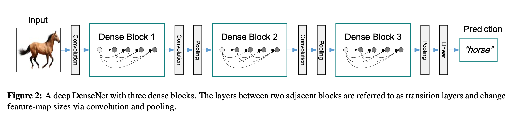
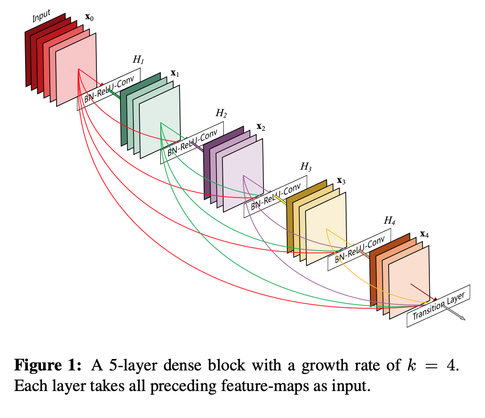
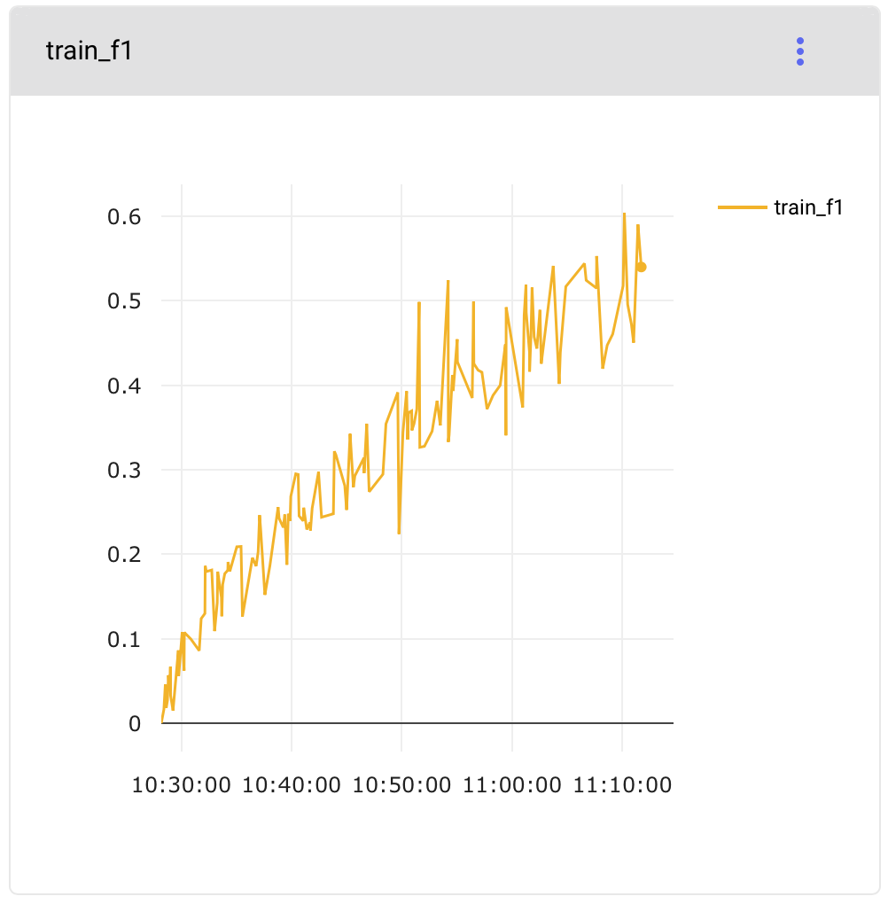
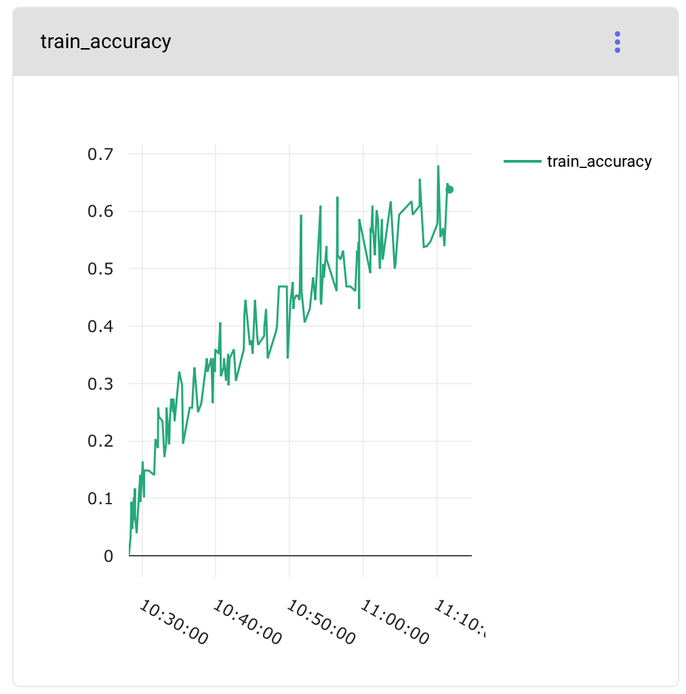
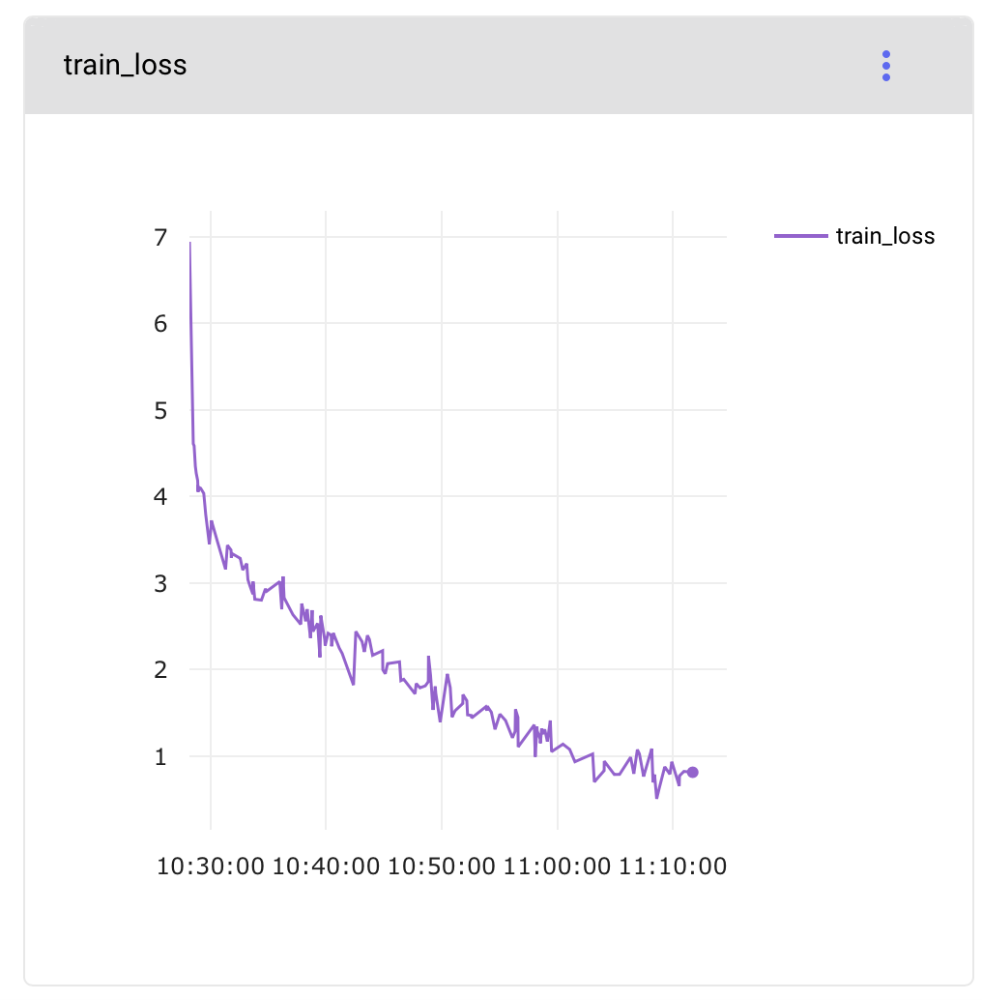
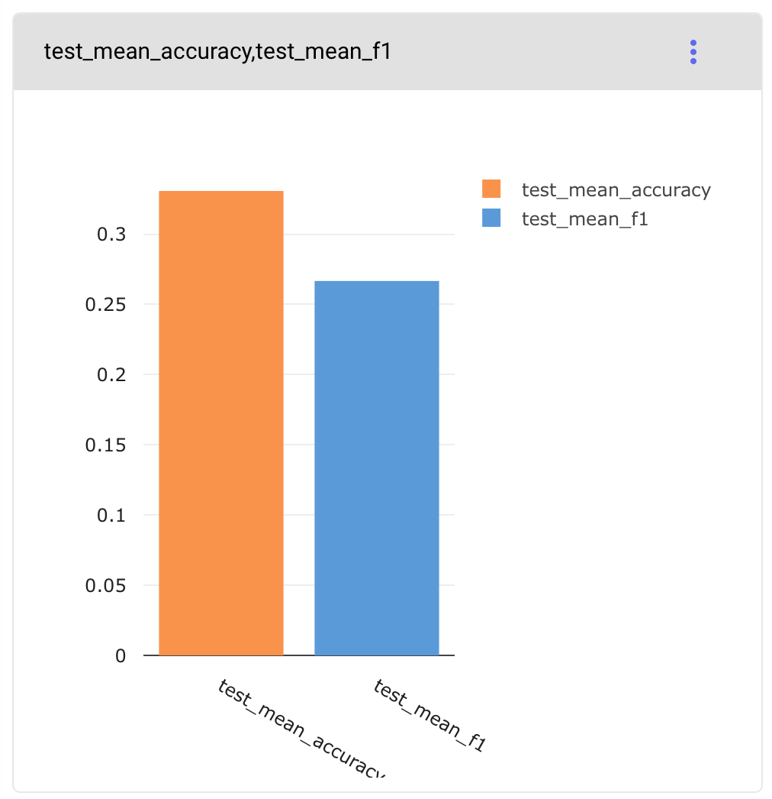

# Image classification demo of DenseNet in PyTorch on CIFAR 100

## Architecture

### Model Architecture

### Dense Block

## Results

- [Comet.ML Logs](https://www.comet.ml/fastrino/fastrino/11700425158b4ee2a3c02a2fa3e335a1)
- Train F1
  
- Train accuracy
  
- Loss
  
- Test accuracy & F1
  

## References

1. Original Paper: [Densely Connected Convolutional Networks](https://arxiv.org/abs/1608.06993)
2. Tutorial: [Implementing DenseNet from Scratch](https://d2l.ai/chapter_convolutional-modern/densenet.html)
3. PyTorch Vision: [Reference Implementation](https://github.com/pytorch/vision/blob/master/torchvision/models/densenet.py)
